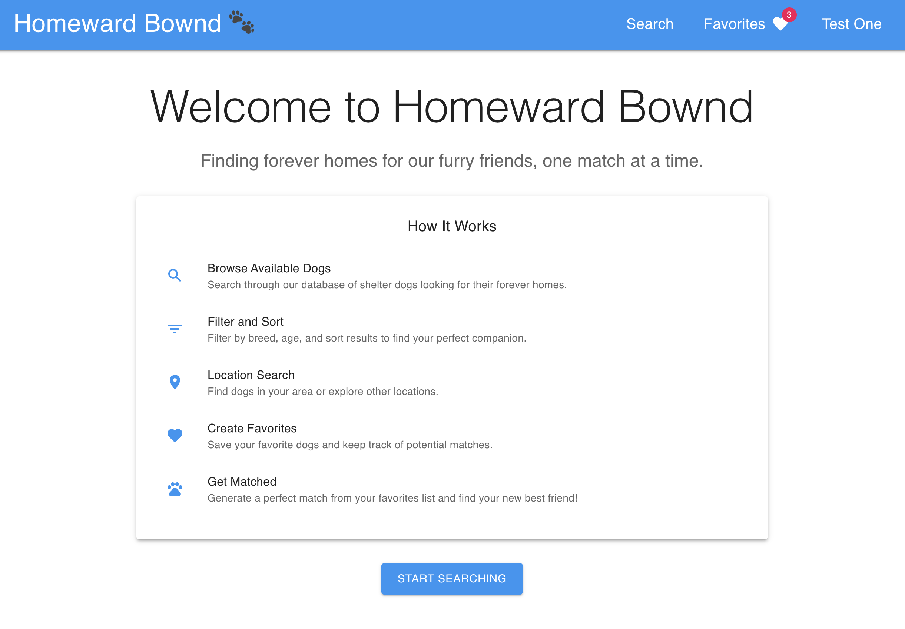
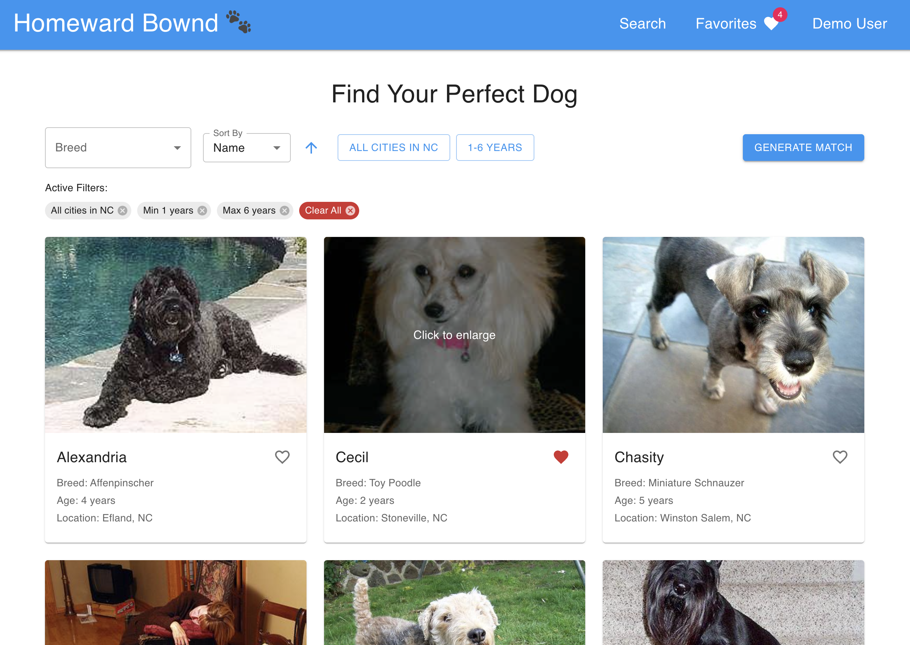
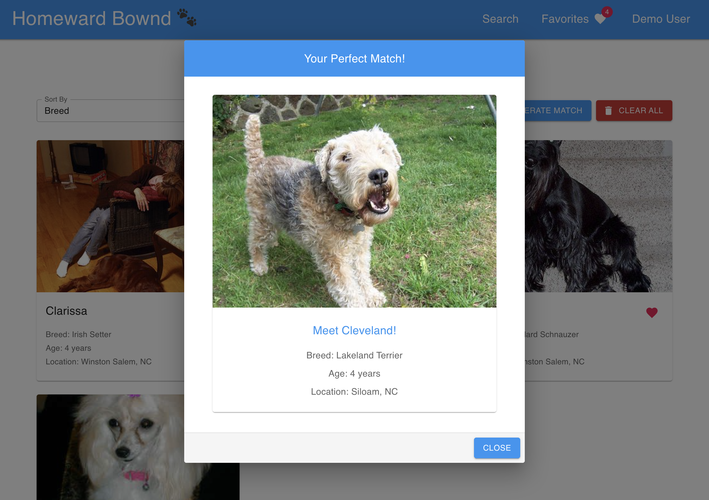

# Homeward Bound - Dog Adoption Search

A modern web application for searching and finding your perfect dog companion. Built with React and Material-UI, this application allows users to search through a database of dogs, filter by various criteria, and save their favorites. All in order to find their perfect match!

## Screenshots

### Welcome Page

The welcome page introduces users to Homeward Bound, explaining how they can find their perfect dog companion through our search and match features.

### Main Search Interface

The main search page features a comprehensive search interface with breed selection, location and age filters, and a grid of available dogs. Users can easily filter, sort, and save their favorite dogs.

### Match Generation

After saving favorite dogs, users can generate a match to find their perfect companion based on their preferences.

## Features

### Search Functionality
- **Breed Selection**: Search for dogs by specific breeds
- **Location Filtering**: 
  - Filter by state
  - Select specific cities within a state
  - View dogs available in your area
- **Age Filtering**:
  - Set minimum age
  - Set maximum age
  - Find dogs within your preferred age range
- **Sorting Options**:
  - Sort by breed
  - Sort by name
  - Sort by age
  - Toggle between ascending and descending order

### User Experience
- **Responsive Design**: Works seamlessly on desktop and mobile devices
- **Interactive UI**:
  - Click to enlarge dog images
  - Visual feedback for active filters
  - Clear filter indicators
  - Pagination for search results
- **Persistent Filters**: Your search preferences are saved between sessions
- **Favorite System**: Save dogs you're interested in for later reference

### Additional Features
- **Match Generation**: Get matched with your perfect dog based on your favorites
- **Location Information**: View detailed city and state information for each dog
- **Accessibility**: Built with accessibility in mind, supporting screen readers and keyboard navigation

## Technologies Used

- **Frontend Framework**: React with TypeScript
- **UI Library**: Material-UI (MUI)
- **State Management**: React Context API
- **Styling**: CSS Modules
- **API Integration**: Fetch API
- **Local Storage**: Browser's localStorage for persisting user preferences

## Getting Started

### Prerequisites
- Node.js (v14 or higher)
- npm (v6 or higher)

### Installation

1. Clone the repository:
```bash
git clone https://github.com/yourusername/homeward-bownd.git
cd homeward-bownd
```

2. Install dependencies:
```bash
npm install
```

3. Start the development server:
```bash
npm start
```

The application will open in your default browser at `http://localhost:3000`.

### Available Scripts

- `npm start`: Runs the app in development mode
- `npm test`: Launches the test runner
- `npm run build`: Builds the app for production
- `npm run eject`: Ejects from Create React App (one-way operation)

## Project Structure

```
src/
├── components/         # React components
├── context/           # React Context providers
├── services/          # API service functions
├── stylesheets/       # CSS modules
├── types/            # TypeScript type definitions
├── utils/            # Utility functions and constants
├── App.tsx           # Main application component
└── index.tsx         # Application entry point
```

## Acknowledgments

- Built with [Create React App](https://github.com/facebook/create-react-app)
- UI components from [Material-UI](https://mui.com/)
- Dog data provided by the Fetch API
